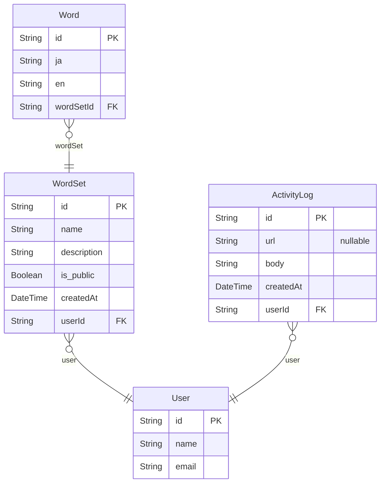

# en_word

## URL

- サイト：<https://en-word.negisosu.com>
- リポジトリ：<https://github.com/negisosu/en_word>

## 概要

開発理由：自身が定期試験時の英語の勉強に単語帳が欲しくなった。

単語帳のウェブアプリケーションやiOSアプリケーションはすでに既存のものがたくさんある。しかし、

- 独自UIよりshadcn/uiベースの方がみやすい
- 自身のウェブアプリケーション開発の練習になる
- 覚えたい単語を見つけた時、すぐに登録したい

以上の理由からこのウェブアプリケーションを開発した。

## 主な機能

### ダッシュボードからの手軽な単語登録ができる

新しく覚えたい英単語を見つけたとき、ネストの深いところに行かずに、一番上のダッシュボードからすぐに登録できるような英単語帳アプリケーションです。

## その他機能

### 英語の自動翻訳

単語登録のフォームで英語を入力してもらうと、日本語に自動で翻訳する。また、文面によって覚えたい覚え方がある時のために、自動翻訳をOFFにすることも可能

### 単語帳の作成・編集・削除

単語帳のタイトルや説明を好きなときに編集・削除可能。単語帳を削除したとき、自動でその単語帳に登録されていた単語も削除される。

### 単語帳に単語を追加・削除

ダッシュボード上では単語帳の指定が可能、単語帳それぞれのページではその単語帳に単語を追加。

### 単語帳モード

現実の通常の単語帳のように、英語をみて、日本語を思い出すような形で単語帳を確認可能

2025/5/30時点：英語→日本語モードしかないため、日本語→英語モードも開発中

### ローディングUI

ロード時間を削減するために情報取得を行うコンポーネントにローディングUIを適用

## 使用技術

- フロントエンド：Typescript, React, Next.js, TailwindCSS, Framer Motion, shadcn/ui, Lucide, v0
- バックエンド：Next.js, zod, prisma, Cloud Translate API
- データベース：Neon
- 認証：Clerk
- デプロイ：Vercel, GitHub Actions

このサービスが単語帳なので単語登録が頻繁になる。レンダリングが多くなると考えたのでレンダリング処理に強いNext.jsを使用。

デプロイ先としてNext.jsの最適化がされたVercelを使用。

UIのベースとしてshadcn/uiを使用。アイデアを得るために多少v0を使用してUIを構築した。

フォームのバリデーションにzodを使用。

データベースとしてVercel Storageから作成でき、無料枠の広いNeonを使用。

データベースの操作にORMのprismaを使用。

認証として構築手順が簡単なClerkを使用。

## データ設計

## 今後の修正・改善・追加

### Wordの追加処理の改善

現在のWordの追加方法は

1. フォーム送信（クライアント）
2. リクエスト送信（クライアント→サーバー）
3. バリデーション（サーバー）
4. DB書き込み（サーバー）
5. キャッシュ更新（サーバー）
6. リダイレクト（サーバー）
7. リダイレクト先へ遷移（クライアント）
8. ページのレンダリング時にデータ取得（サーバー）
9. ページ表示（クライアント）

としている。問題としてバリデーションや作成をしてからリダイレクトしているため、時間がかかって不便に感じる。そのため、画面表示をいちいちデータ取得するのではなく、useStateに初期レンダリングでうけとったデータを入れて、フォーム送信をしたとき、クライアント側はState更新とバリデーションの結果受け取りのみをする。サーバー側はクライアントの表示に影響することなく、DB書き込みとキャッシュ更新を行うようにすることで、リダイレクト時の不便さを軽減する。

### 不足ページの追加

- 設定
- 使い方
- 日本語→英語の単語帳

サイドバーに設定という項目を用意しているが、まだ実装できていない。設定の中では自動翻訳のデフォルト値や、ユーザーネームの編集などを追加する予定。

現在英語→日本語（英語を見て日本語を思い出す）の単語帳ページは存在するが、日本語→英語（日本語を見て英語を思い出す）の単語帳ページは存在しないため、そのページを追加する。

### アクティビティログの追加

いつ何を作成したかや何回単語帳を学習したかなどの行動のログを残せるようにする。

### 単語帳の公開/非公開

複数のユーザーで単語帳の共有ができるように単語帳の公開/非公開を選べるようにする。

### 細かい機能改善

- パンくずリストのID表記を日本語のタイトルにする
- 単語帳のお気に入り機能追加
- 単語帳一覧や単語帳の単語一覧で検索機能を追加
