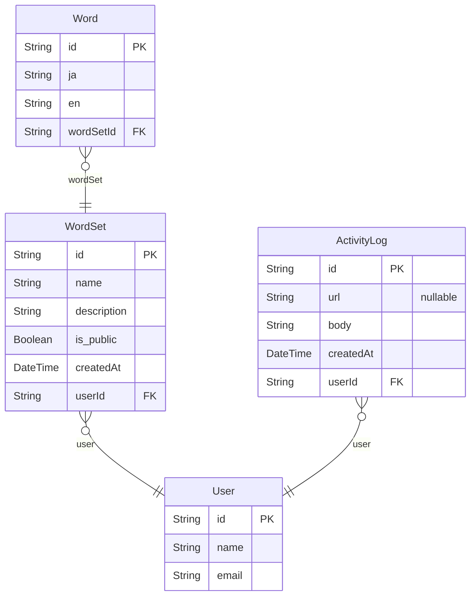

# TITLE

> Generated by [`prisma-markdown`](https://github.com/samchon/prisma-markdown)

- [default](#default)

## default

### `User`

Properties as follows:

- `id`:
- `name`:
- `email`:

### `WordSet`

Properties as follows:

- `id`:
- `name`:
- `description`:
- `is_public`:
- `createdAt`:
- `userId`:

### `Word`

Properties as follows:

- `id`:
- `ja`:
- `en`:
- `wordSetId`:

### `ActivityLog`

Properties as follows:

- `id`:
- `url`:
- `body`:
- `createdAt`:
- `userId`:
